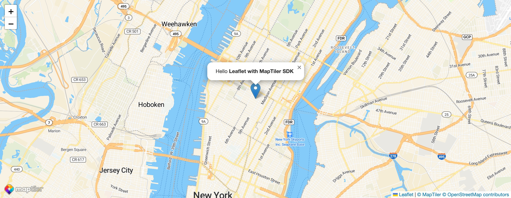
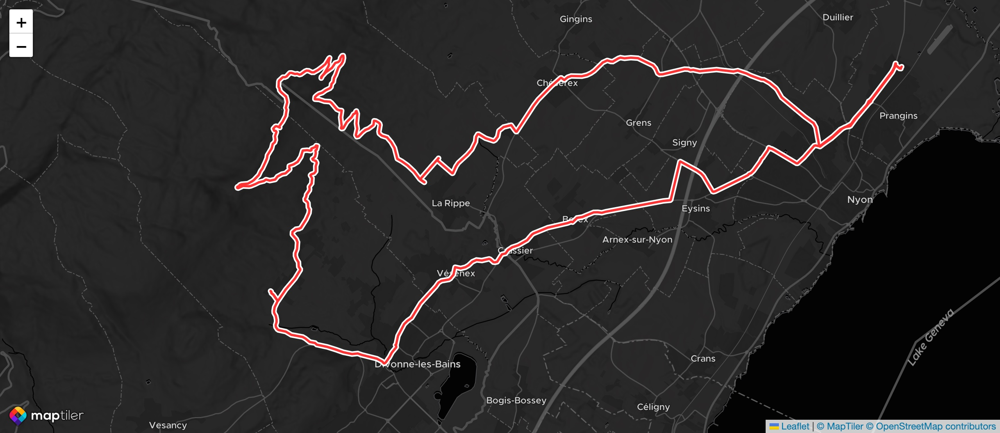

<p align="center">
  <a href="https://docs.maptiler.com/leaflet/examples/vector-tiles-in-leaflet-js/">Vector Tiles in Leaflet JS tutorial →</a><br><br>
  
</p>

Add a layer to your Leaflet app that displays [MapTiler SDK](https://docs.maptiler.com/sdk-js/) basemaplayer!

**MapTiler SDK JS** is an extension of MapLibre GL JS, fully backward compatible, tailored for MapTiler Cloud, and with plenty of extra features, including **TypeScript** support!



## How to use vector tile layer in Leaflet with MapTiler SDK JS

### From CDN with the UMD bundle
The UDM *leaflet-maptilersdk* bundle is not packaged with Leaflet nor with MapTiler SDK, so those will have to be imported as `<script>` separately in the `<head>` HTML element as follows:

```html
<!-- Leaflet -->
<link rel="stylesheet" href="https://unpkg.com/leaflet@1.9.3/dist/leaflet.css" />
<script src="https://unpkg.com/leaflet@1.9.3/dist/leaflet.js"></script>

<!-- MapTiler SDK -->
<script src="https://cdn.maptiler.com/maptiler-sdk-js/v3.0.0/maptiler-sdk.umd.min.js"></script>
    <link href="https://cdn.maptiler.com/maptiler-sdk-js/v3.0.0/maptiler-sdk.css" rel="stylesheet" />

<!-- Leaflet plugin for MapTiler SDK Layers -->
<script src="https://cdn.maptiler.com/leaflet-maptilersdk/v3.0.0/leaflet-maptilersdk.js"></script>
```

Then, in the HTML `<body>`, declare the container that will host the map:
```html
<div id="map"></div>
```

Finally, add a `<script>` to initialize the Leaflet Map that contains a MapTiler SDK Layer:

```js
// Center the map on Manhattan, zoom level 13
const map = L.map('map').setView([40.7468, -73.98775], 13);

// Add a marker with a popup
L.marker([40.7468, -73.98775])
  .bindPopup("Hello <b>Leaflet with MapTiler SDK</b>!<br>Whoa, it works!")
  .addTo(map)
  .openPopup();

// Create a MapTiler Layer inside Leaflet
const mtLayer = L.maptiler.maptilerLayer({
  // Get your free API key at https://cloud.maptiler.com
  apiKey: "YOUR_MAPTILER_API_KEY",
}).addTo(map);
```

The notation `L.maptiler.maptilerLayer()` is the typical Leaflet way to expose a factory function that creates a layer. Even though our plugin exposes other ways to do exactly the same thing, this notation may suit your programming style better.  
The following are all yielding the same result:
- `const mtLayer = L.maptiler.maptilerLayer( options )` (mind the lowercase `m`, it's a factory function)
- `const mtLayer = new L.maptiler.MaptilerLayer( options )` (mind the uppercase `M`, it's a class)
- `const mtLayer = leafletmaptilersdk.maptilerLayer( options )` (mind the lowercase `m`, it's a factory function)
- `const mtLayer = new leafletmaptilersdk.MaptilerLayer( options )` (mind the upper case `M`, it's a class)


### From ES module using `import`
We use the [Vite vanilla JS app](https://vitejs.dev/guide/) as a starting point for the following examples.

The typical Leaflet plugin usually adds new elements directly in the global object `L`. ⚠️ Since the version 3.0.0 (and the addition of TypeScript support), this plugin no longer adds anything to the global `L` namespace in ES mode. Instead, the library opts for a cleaner and more modern design:

```js
// import Leaflet and its style
import L from "leaflet";
import "leaflet/dist/leaflet.css";

// Import some elements from the Leaflet-MapTiler Plugin
import { Language, MaptilerLayer, MapStyle } from "@maptiler/leaflet-maptilersdk";

// Import your custom style, 
// depending on your configuration, you may have to change how this is done
import './style.css';
```

Then, in the Vite vanilla app, we would have to do exactly like in regular vanilla JS:
```js
// Center the map on Manhattan, zoom level 13
const map = L.map("map").setView([40.7468, -73.98775], 13);

// Center the map on Manhattan, zoom level 13
L.marker([40.7468, -73.98775])
  .bindPopup("Hello <b>Leaflet with MapTiler SDK</b>")
  .addTo(map)
  .openPopup();

// Create a MapTiler Layer inside Leaflet
const mtLayer = new MaptilerLayer({
  // Get your free API key at https://cloud.maptiler.com
  apiKey: "YOUR_MAPTILER_API_KEY",
}).addTo(map);

// Alternatively, we can call the factory function (mind the lowercase `m`)
const mtLayer = maptilerLayer({
  // Get your free API key at https://cloud.maptiler.com
  apiKey: "YOUR_MAPTILER_API_KEY",
}).addTo(map);
```

## From ES module, the *async* way
Some frontend frameworks are very opinionated regarding Server-Side-rendering and will attempt to perform it; that's the case of [Next.js](https://nextjs.org/). But Leaflet does not play well with it because there are some direct calls to the global `window` object, and this would crash on a server. The fix consists of importing Leaflet dynamically, and then `@maptiler/leaflet-maptilersdk` can also be imported.

The React lifecycle `.componentDidMount()` of a class component of the `useEffect []` functional equivalent is only called on the frontend when the component is ready. It's a good moment to dynamically import Leaflet because the `window` globale object is accessible:

```js
useEffect(() => {
  // A self-callable async function because importing packages dynamically is an async thing to do
  (async () => {

    // dynamic import of Leaflet
    const L = await import('leaflet');

    // dynamic import of the library
    const leafletmaptilersdk = await import('@maptiler/leaflet-maptilersdk'); 
    
    // Creating the Leaflet map
    const map = L.map(containerRef.current).setView([51.505, -0.09], 10);

    // Creating the MapTiler Layer
    const mtLayer = new leafletmaptilersdk.MaptilerLayer({
      apiKey: "YOUR_MAPTILER_API_KEY",
    }).addTo(map);

  })();
}, []);
```


### API and options
#### Constructor and Factory function
The option object passed to the factory function `maptilerLayer` or to the constructor `MaptilerLayer` is then passed to the constructor of the Maptiler SDK `Map` class. Read more about the possible options on our [SDK documentation](https://docs.maptiler.com/sdk-js/api/map/).

Here are the major options:

- `geolocate`: [boolean] if `true`, will locate the user and center the map accordingly. Note that Leaflet still requires the use of `.setView()`, but this will be ignored. Default: `false`.
- `language`: [string] by default uses the language from the system settings and falls back to local names. Yet the language can be enforced with one from the list below. Depending on how you are importing, you could use `L.MaptilerLanguage.ENGLISH`, `MaptilerLanguage.ENGLISH` or `leafletmaptilersdk.MaptilerLanguage.ENGLISH`. <details>
  <summary>➡️ See the list of possible languages ⬅️</summary>
  - `L.MaptilerLanguage.AUTO` uses the language of the browser 
  - `L.MaptilerLanguage.STYLE_LOCK` maintains the language as defined in the `style.json`
  - `L.MaptilerLanguage.LATIN` default language that uses latin charset
  - `L.MaptilerLanguage.NON_LATIN` default language that uses non-latin charset
  - `L.MaptilerLanguage.LOCAL` Labels are in their local language, when available
  - `L.MaptilerLanguage.ALBANIAN`
  - `L.MaptilerLanguage.AMHARIC`
  - `L.MaptilerLanguage.ARABIC`
  - `L.MaptilerLanguage.ARMENIAN`
  - `L.MaptilerLanguage.AZERBAIJANI`
  - `L.MaptilerLanguage.BASQUE`
  - `L.MaptilerLanguage.BELORUSSIAN`
  - `L.MaptilerLanguage.BOSNIAN`
  - `L.MaptilerLanguage.BRETON`
  - `L.MaptilerLanguage.BULGARIAN`
  - `L.MaptilerLanguage.CATALAN`
  - `L.MaptilerLanguage.CHINESE`
  - `L.MaptilerLanguage.CORSICAN`
  - `L.MaptilerLanguage.CROATIAN`
  - `L.MaptilerLanguage.CZECH`
  - `L.MaptilerLanguage.DANISH`
  - `L.MaptilerLanguage.DUTCH`
  - `L.MaptilerLanguage.ENGLISH`
  - `L.MaptilerLanguage.ESPERANTO`
  - `L.MaptilerLanguage.ESTONIAN`
  - `L.MaptilerLanguage.FINNISH`
  - `L.MaptilerLanguage.FRENCH`
  - `L.MaptilerLanguage.FRISIAN`
  - `L.MaptilerLanguage.GEORGIAN`
  - `L.MaptilerLanguage.GERMAN`
  - `L.MaptilerLanguage.GREEK`
  - `L.MaptilerLanguage.HEBREW`
  - `L.MaptilerLanguage.HINDI`
  - `L.MaptilerLanguage.HUNGARIAN`
  - `L.MaptilerLanguage.ICELANDIC`
  - `L.MaptilerLanguage.INDONESIAN`
  - `L.MaptilerLanguage.IRISH`
  - `L.MaptilerLanguage.ITALIAN`
  - `L.MaptilerLanguage.JAPANESE`
  - `L.MaptilerLanguage.JAPANESE_HIRAGANA`
  - `L.MaptilerLanguage.JAPANESE_KANA`
  - `L.MaptilerLanguage.JAPANESE_LATIN`
  - `L.MaptilerLanguage.JAPANESE_2018`
  - `L.MaptilerLanguage.KANNADA`
  - `L.MaptilerLanguage.KAZAKH`
  - `L.MaptilerLanguage.KOREAN`
  - `L.MaptilerLanguage.KOREAN_LATIN`
  - `L.MaptilerLanguage.KURDISH`
  - `L.MaptilerLanguage.ROMAN_LATIN`
  - `L.MaptilerLanguage.LATVIAN`
  - `L.MaptilerLanguage.LITHUANIAN`
  - `L.MaptilerLanguage.LUXEMBOURGISH`
  - `L.MaptilerLanguage.MACEDONIAN`
  - `L.MaptilerLanguage.MALAYALAM`
  - `L.MaptilerLanguage.MALTESE`
  - `L.MaptilerLanguage.NORWEGIAN`
  - `L.MaptilerLanguage.OCCITAN`
  - `L.MaptilerLanguage.POLISH`
  - `L.MaptilerLanguage.PORTUGUESE`
  - `L.MaptilerLanguage.ROMANIAN`
  - `L.MaptilerLanguage.ROMANSH`
  - `L.MaptilerLanguage.RUSSIAN`
  - `L.MaptilerLanguage.SCOTTISH_GAELIC`
  - `L.MaptilerLanguage.SERBIAN_CYRILLIC`
  - `L.MaptilerLanguage.SERBIAN_LATIN`
  - `L.MaptilerLanguage.SLOVAK`
  - `L.MaptilerLanguage.SLOVENE`
  - `L.MaptilerLanguage.SPANISH`
  - `L.MaptilerLanguage.SWEDISH`
  - `L.MaptilerLanguage.TAMIL`
  - `L.MaptilerLanguage.TELUGU`
  - `L.MaptilerLanguage.THAI`
  - `L.MaptilerLanguage.TURKISH`
  - `L.MaptilerLanguage.UKRAINIAN`
  - `L.MaptilerLanguage.WELSH`

</details>

- `style`: [string | style definition] MapTiler has created many professional-looking styles that suit the majority of use cases. Directly from the constructor, you can specify the short style ID. Alternatively, a style URL or a complete style definition object can also be used. Default: `L.MaptilerStyle.STREETS`. Depending on how you are importing, you could use `L.MaptilerStyle.STREETS`, `MaptilerStyle.STREETS` or `leafletmaptilersdk.MaptilerStyle.STREETS`. <details>
  <summary>➡️ See the list of the MapTiler style IDs ⬅️</summary>
  - `L.MaptilerStyle.STREETS`, reference style for navigation and city exploration
    - `L.MaptilerStyle.STREETS.DARK` (variant)
    - `L.MaptilerStyle.STREETS.LIGHT` (variant)
    - `L.MaptilerStyle.STREETS.PASTEL` (variant)
  - `L.MaptilerStyle.SATELLITE` reference style satellite and airborne imagery (no variants)
  - `L.MaptilerStyle.HYBRID` reference style satellite and airborne imagery with labels (no variants)
  - `L.MaptilerStyle.OUTDOOR` reference style for adventure
    - `L.MaptilerStyle.OUTDOOR.DARK` (variant)
  - `L.MaptilerStyle.WINTER` reference style for winter adventure
    - `L.MaptilerStyle.WINTER.DARK` (variant)
  - `L.MaptilerStyle.DATAVIZ`, the perfect style for data visualization, with very little noise
    - `L.MaptilerStyle.DATAVIZ.DARK` (variant)
    - `L.MaptilerStyle.DATAVIZ.LIGHT` (variant)
  - `L.MaptilerStyle.BASIC` reference style for minimalist design and general purpose
    - `L.MaptilerStyle.BASIC.DARK` (variant)
    - `L.MaptilerStyle.BASIC.LIGHT` (variant)
  - `L.MaptilerStyle.BRIGHT` reference style for high contrast navigation
    - `L.MaptilerStyle.BRIGHT.DARK` (variant)
    - `L.MaptilerStyle.BRIGHT.LIGHT` (variant)
    - `L.MaptilerStyle.BRIGHT.PASTEL` (variant)
  - `L.MaptilerStyle.TOPO` reference style for topographic study
    - `L.MaptilerStyle.TOPO.SHINY` (variant)
    - `L.MaptilerStyle.TOPO.PASTEL` (variant)
    - `L.MaptilerStyle.TOPO.TOPOGRAPHIQUE` (variant)
  - `L.MaptilerStyle.VOYAGER` reference style for stylish yet minimalist maps
    - `L.MaptilerStyle.VOYAGER.DARK` (variant)
    - `L.MaptilerStyle.VOYAGER.LIGHT` (variant)
    - `L.MaptilerStyle.VOYAGER.VINTAGE` (variant)
  - `L.MaptilerStyle.TONER` reference style for very high contrast stylish maps 
    - `L.MaptilerStyle.TONER.BACKGROUND` (variant)
    - `L.MaptilerStyle.TONER.LITE` (variant)
    - `L.MaptilerStyle.TONER.LINES` (variant)
  - `L.MaptilerStyle.OPENSTREETMAP` reference style for the classic OSM look
  - `L.MaptilerStyle.OCEAN` reference style with seabed isoline, hilshading and trenches info

  You can also easily [create your custom map style](https://maptiler.com/cloud/customize/)
</details>  

- `apiKey`: [string] your MapTiler Cloud API key. Default: empty string

The `MaptilerLayer` constructor and/or `maptilerLayer` factory function returns a Leaflet Maptiler layer that we will call `mtLayer`.

#### Method `.addTo(map)`
The same behavior as `.addTo` on any Leaflet layer: this adds the layer to a given
map or group.

#### Method `.getMaptilerMap(): maptilerLayer.Map`
Returns `mapltilersdk.Map` object.

#### Method `.setStyle(s)`
Update the style with a style ID, style URL, or style definition. The easiest is to use a built-in style ID such as listed above with the form `L.MaptilerStyle.STREETS`.

#### Method `.setLanguage(l)`
Update the map language. For this, the best is to use a built-in language shorthand with the form `L.MaptilerLanguage.JAPANESE`, such as listed above.

#### Methods to add vector layers
We have added an even easier way to use the MapTiler SDK [vector layer helpers](https://github.com/maptiler/maptiler-sdk-js#vector-layer-helpers), directed under the instance of the custom Leaflet layer. You can now call `.addPolyline`, `.addPolygon`, `.addPoint`, and `.addHeatmap` using a path to a file or the ID of a dataset hosted on MapTiler Cloud.   
Let's see an example:

```js
// Init the map
const map = L.map('map').setView([46.3796, 6.1518], 13);

// Creating and mounting the MapTiler SDK Layer
const mtLayer = new L.MaptilerLayer({
  apiKey: "YOUR_MAPTILER_API_KEY",
  style: L.MaptilerStyle.BACKDROP.DARK,
}).addTo(map);

// The custom event "ready" is triggered by the MaptilerLayer when the internal
// MapTiler Map instance is fully loaded and can be added more layers
mtLayer.on("ready", () => {
  
  // Leverage the MapTiler SDK layer helpers to add polyline / point / polygon / heatmap layers easily
  mtLayer.addPolyline({
    // A Maptiler Cloud dataset ID, or URL to GeoJSON/GPX/KML
    data:"74003ba7-215a-4b7e-8e26-5bbe3aa70b05",
    lineColor: "#008888", // optional
    outline: true,        // optional
    outlineWidth: 2,      // optional
  });

})
```

Here is the result, a bike ride in France and Switzerland, displayed on the dark Backdrop MapTiler style:


#### Event `"ready"`
The `"ready"` event is triggered when the internal MapTiler SDK Map instance is fully loaded and can accept some more layers to be added. This corresponds to the MapTiler SDk and MapLibre `load` event.

## Bug Reports & Feature Requests
Please use the [issue tracker](https://github.com/maptiler/leaflet-maptilersdk/issues) to report any bugs or file feature requests.

## License
See [LICENSE.md](https://github.com/maptiler/leaflet-maptilersdk/blob/main/LICENSE.md)


